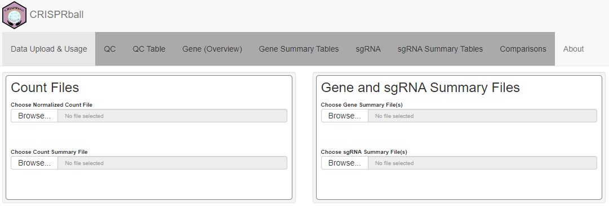
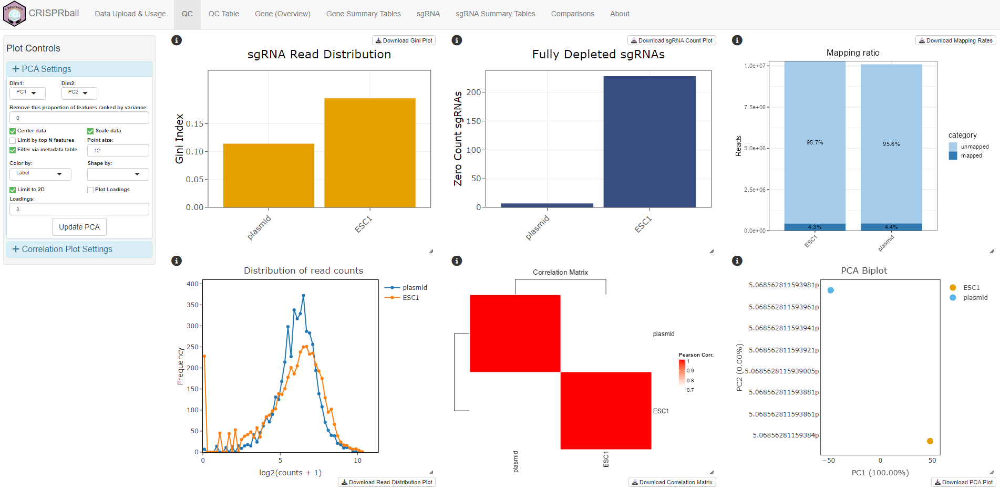
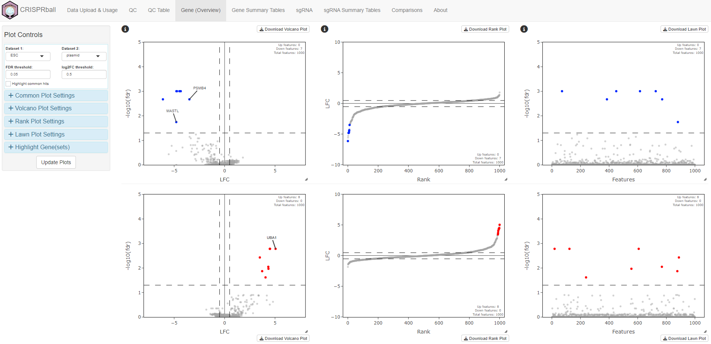
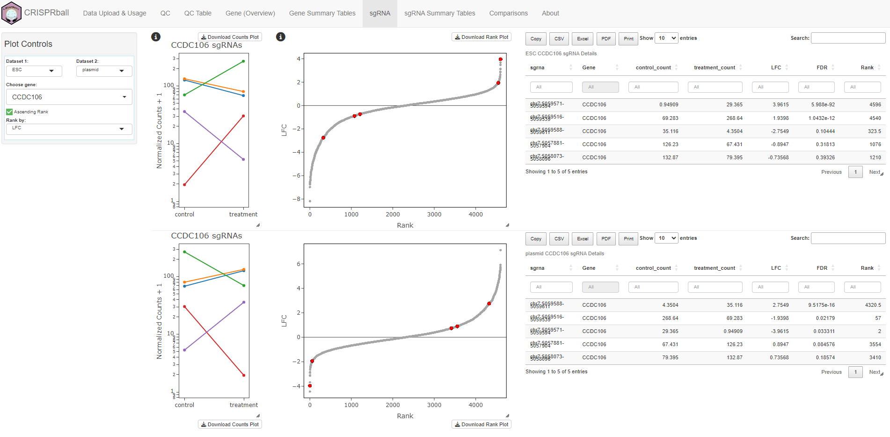
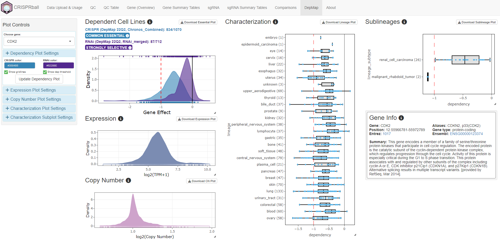

```{r, include=FALSE}
library(BiocStyle)
knitr::opts_chunk$set(echo = TRUE, fig.align = "center", message = FALSE, warning = FALSE)
```

# Introduction

CRISPR screens are becoming more and more common, and as such, so is the need to easily 
interpret, visualize, compare, and explore the results of these assays. 

**CRISPRball** is a Shiny application to explore, visualize, filter, and 
integrate CRISPR screens with public data and multiple datasets. 
In particular, it allows for publication-quality figure generation 
including full aesthetic customization and interactive labeling, filtering 
of results using DepMap Common Essential genes, simple comparisons between datasets/timepoints/treatments, etc.

It is designed for end users and may be particularly useful for 
bioinformatics/genome editing cores that perform basic analyses before 
returning results to users. Pointing users to the online version of the app 
(or a hosted one) will allow them to quickly wade through and interpret their data.

Currently, it supports the output from [MAGeCK](https://sourceforge.net/projects/mageck/) RRA and MLE analysis methods.
Support for the output of additional analysis tools and methods will be added upon request.

## Usage

Starting the app is as simple as calling the `CRISPRball` function.

```{r, eval = FALSE}
library("CRISPRball")
CRISPRball()
```

Users can then upload their data within the app, which will enable specific tabs in the application
as the data is provided.

```{r, fig.cap="Screenshot of the `CRISPRball` application, when launched as a server where users can directly upload MAGeCK RRA or MLE output. Information on the format of the expected data are provided in the following sections.", echo=FALSE}

```

One can also pass their input data directly as input - all that are needed 
are file paths to the MAGeCK output files. 

Passing data directly can be useful when hosting the app on a local Shiny server where 
having pre-loaded data for the user is wanted. This is particularly useful for core or 
shared resource facilities that perform basic analyses for end-users.

## MAGeCK RRA Output

In this case, we'll use the example output from the 
[third MAGeCK tutorial](https://sourceforge.net/p/mageck/wiki/demo/#the-third-tutorial-going-through-a-public-crisprcas9-screening-dataset). 

In this example, the two datasets are just reverse comparisons (ESC vs plasmid & plasmid vs ESC) where DDX27 has 
been manually altered in the ESC vs plasmid comparison to no longer be a significant hit.

```{r, eval = TRUE}
# Create lists of results summaries for each dataset.
d1.genes <- read.delim(system.file("extdata", "esc1.gene_summary.txt",
    package = "CRISPRball"
), check.names = FALSE)
d2.genes <- read.delim(system.file("extdata", "plasmid.gene_summary.txt",
    package = "CRISPRball"
), check.names = FALSE)

d1.sgrnas <- read.delim(system.file("extdata", "esc1.sgrna_summary.txt",
    package = "CRISPRball"
), check.names = FALSE)
d2.sgrnas <- read.delim(system.file("extdata", "plasmid.sgrna_summary.txt",
    package = "CRISPRball"
), check.names = FALSE)

count.summ <- read.delim(system.file("extdata", "escneg.countsummary.txt",
    package = "CRISPRball"
), check.names = FALSE)
norm.counts <- read.delim(system.file("extdata", "escneg.count_normalized.txt",
    package = "CRISPRball"
), check.names = FALSE)

# Look at the first few rows of the gene summary for the ESC vs plasmid comparison.
head(d1.genes)
```

We can then provide this data to the `CRISPRball` function.

```{r, eval = FALSE}
genes <- list(ESC = d1.genes, plasmid = d2.genes)
sgrnas <- list(ESC = d1.sgrnas, plasmid = d2.sgrnas)

CRISPRball(
    gene.data = genes, sgrna.data = sgrnas,
    count.summary = count.summ, norm.counts = norm.counts
)
```

## MAGeCK MLE Output

CRISPRball also supports the MLE output from MAGeCK. In this case, we'll use the example data from the [fourth MAGeCK tutorial](https://sourceforge.net/p/mageck/wiki/demo/#the-fourth-tutorial-using-mageck-mle-module).

```{r, eval = FALSE}
# Create lists of results summaries for each dataset.
genes <- read_mle_gene_summary(system.file("extdata", "beta_leukemia.gene_summary.txt",
    package = "CRISPRball"
))

count.summ <- read.delim(system.file("extdata", "escneg.countsummary.txt",
    package = "CRISPRball"
), check.names = FALSE)
norm.counts <- read.delim(system.file("extdata", "escneg.count_normalized.txt",
    package = "CRISPRball"
), check.names = FALSE)

CRISPRball(
    gene.data = genes, 
    count.summary = count.summ, norm.counts = norm.counts
)
```

## The QC Tab

On load, the application will display the **QC** tab, which provides multiple interactive plots to assess the quality control of all 
samples in the dataset. Plots include those that assess the Gini Index (a measure of read distribution inequality), 
counts of fully depleted sgRNAs, percentage of reads mapped, read distributions across sgRNAs, correlation matrix between samples, 
and a PCA plot containing all samples.

Controls to adjust the plots are provided in the sidebar in the left side of the application. Plots are re-sizable and easily 
download as SVGs using the plotly controls. In addition, interactive HTML versions of the plots can be downloaded with the 
**Download** buttons above or below each plot.

```{r, fig.cap="Screenshot of the `CRISPRball` application, when launched with MAGeCk RRA output provided.", echo=FALSE}

```

## The Gene (Overview) Tab

This tab provides an overview of the gene-level results for up to two comparisons. It includes a volcano plot, rank plot, and
randomly ordered "lawn" plot for each comparison of interest. All plots are interactive and fully customizable via the controls
in the sidebar.

```{r, fig.cap="Screenshot of the `CRISPRball` Gene (Overview) tab.", echo=FALSE}

```

Common hits between two comparisons can easily be highlighted by selecting the **Highlight Common Hits** checkbox in the sidebar.

### Highlighting Gene(sets)

Often, it can be useful to label a set of genes on the plots. 
This can be done by passing a named list of gene identifiers to the `genesets` argument.

```{r, eval = FALSE}
library("msigdbr")

# Retrieve MSigDB Hallmark gene sets and convert to a named list.
gene.sets <- msigdbr(species = "Homo sapiens", category = "H")
gene.sets <- gene.sets %>% split(x = .$gene_symbol, f = .$gs_name)

# Can also add genesets manually.
gene.sets[["my_fav_genes"]] <- c("TOP2A", "FECH", "SOX2", "DUT", "RELA")

CRISPRball(
    gene.data = genes, sgrna.data = sgrnas, count.summary = count.summ,
    norm.counts = norm.counts, genesets = gene.sets
)
```

Such genesets can then be highlighted very easily on the plots in the **Gene (Overview)** 
tab using the **"Highlight Gene(sets)"** inputs in the sidebar.

Individual genes of interest can also be added by the user manually from within the app.

## The sgRNA Tab

This tab is mostly only useful with MAGeCK RRA results. It provides two plots for up to two comparisons.
The first allows users to view normalized sgRNA counts across two conditions - which is helpful for
identification of poor sgRNAs and validation of hits.

The second provides the sgRNA rank among all sgRNAs for a chosen effect size variable.
This provides a useful view of how a given sgRNA compares to all sgRNAs.

```{r,fig.cap="Screenshot of the `CRISPRball` sgRNA tab, when launched with MAGeCk RRA output provided.", echo=FALSE}

```

## The DepMap Tab

[DepMap](https://depmap.org/portal/) contains a multitude of data for hundreds of cell lines, 
including CRISPR/RNAi screen results, gene expression data, copy number variation, and more. 
This data can be extremely useful to remove common dependencies from your own results, look 
at expression or copy number for a given gene across various lineages or diseases, and to identify 
hits that are selective to a given (sub)lineage.

For fast access to this data, **CRISPRball** includes a function (`build_depmap_db()`) to build 
a SQLite database using the [depmap](https://bioconductor.org/packages/release/data/experiment/html/depmap.html) R package. 
**This database will be large, >4 GB.**

This SQLite database can then be passed to the app and the data 
contained therein easily explored in the **DepMap** tab.

```{r, eval = FALSE}
library("depmap")
library("pool")
library("RSQLite")

# This will take a few minutes to run.
# The database will be named "depmap_db.sqlite" and placed in the working directory.
build_depmap_db()

CRISPRball(
    gene.data = genes, sgrna.data = sgrnas, count.summary = count.summ,
    norm.counts = norm.counts, genesets = gene.sets, depmap.db = "depmap_db.sqlite"
)
```

```{r, fig.cap="Screenshot of the `CRISPRball` application, with focus on the DepMap tab for CDK2.", echo=FALSE}}

```

### Filtering DepMap Common Essential Hits

When provided, one can also easily filter the DepMap common essential hits from the results in the **Gene (Overview)** tab via
the checkboxes in the sidebar.

## Additional Help

Almost every input in the app will display a helpful tooltip 
explaining its function on hover. 
Plots also have an information 
icon that will explain the plot contents when hovered or clicked.

## SessionInfo

<details>

<summary>Click to expand</summary>

```{r, echo = FALSE}
sessionInfo()
```

</details>
